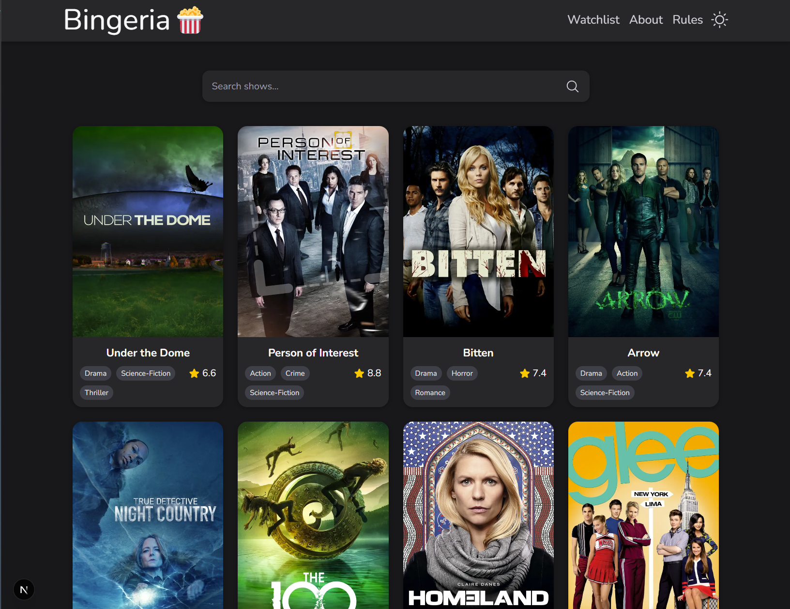
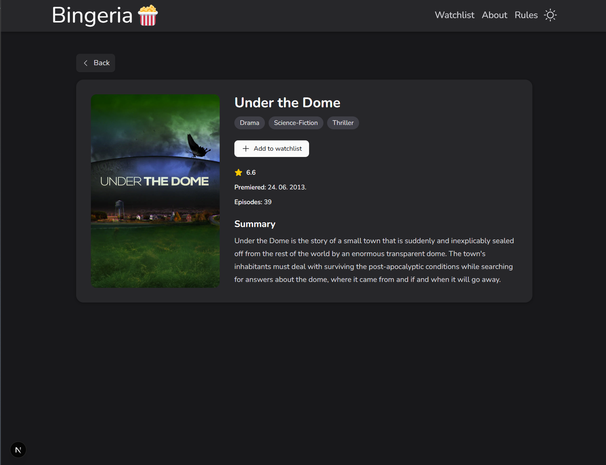
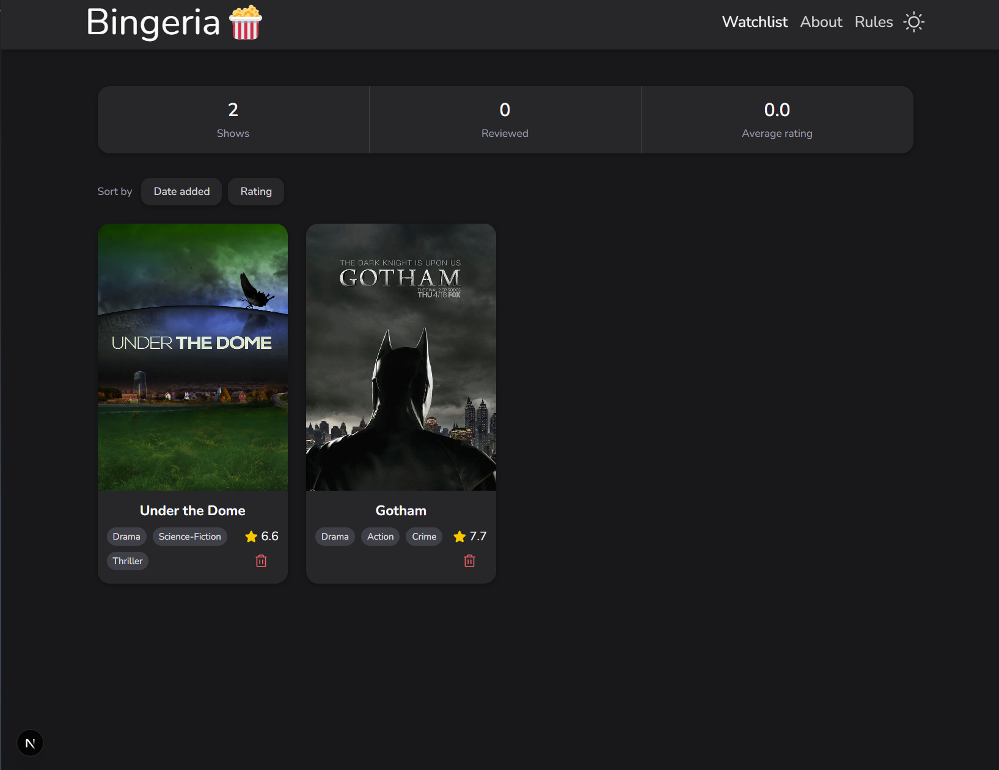

# Bingeria 🍿

Bingeria je Next.js aplikacija za pregled i pretraživanje serija, spremanje serija na watchlist te pisanje recenzija.

Podaci o serijama dohvaćaju se s javnog [TVmaze API-ja](https://www.tvmaze.com/api).

## Funkcionalnosti

- katalog i pretraga serija s debounceom
- detalji serije
- watchlist s trajnom pohranom u JSON datoteci
- dodavanje i uklanjanje serija pomoću Server Actions
- dodavanje, uređivanje i brisanje recenzija
- React Hook Form + Zod validacija na klijentu i serveru
- statistika i sortiranje watchlista
- dark/light tema i responzivan dizajn
- route-specific loading i prilagođeni error/404 prikazi
- dodavanje na watchlist radi i bez JavaScripta
- prvih 10 stranica detalja serije statički se generira pomoću `generateStaticParams`

## Tehnologije

Next.js, TypeScript, Tailwind CSS, React Hook Form, Zod, Sonner, Iconify i TVmaze API.

## Korištenje AI alata

AI alati korišteni su kao pomoć tijekom razvoja projekta, prvenstveno za:

- pomoć pri pojedinim UI i styling odlukama koje bih mogao implementirati i samostalno, ali uz više vremena
- pomoć pri pisanju i uređivanju README dokumentacije
- završni code review, pronalaženje i ispravljanje neprimijećenih problema i edge caseova te provjeru zadovoljavanja zahtjeva zadatka
- analizu i rješavanje problema vezanog uz istovremeni rad `loading.tsx` skeletona i `Add to watchlist` funkcionalnosti bez JavaScripta

Posebno kod tog problema AI je korišten za analizu mogućih rješenja i Next.js ponašanja, nakon čega je odabrano rješenje koje zadržava loading skeleton, Server Action bez JavaScripta i zajednički details UI.

## Pokretanje projekta

```bash
git clone https://github.com/jcelic/bingeria
cd bingeria
npm install
npm run dev
```

Aplikacija je zatim dostupna na:

```text
http://localhost:3000
```

Production build:

```bash
npm run build
```

## Struktura projekta

```text
bingeria/
├── data/
│   └── watchlist.json
└── src/
    ├── app/
    ├── components/
    ├── hooks/
    ├── lib/
    │   ├── actions/
    │   ├── api/
    │   ├── data/
    │   ├── utils/
    │   └── validations/
    └── types/
```

### Zašto je tražilica Client Component, a lista rezultata nije?

Tražilica mora biti Client Component jer koristi React hookove za kontrolirani input, debounce i promjenu URL-a te mora reagirati na korisnikov unos.

Lista rezultata ne treba biti Client Component jer sama ne koristi React state, event handlere ni druge client-side hookove. Server čita q parametar iz URL-a, dohvaća rezultate s TVmaze API-ja i renderira ih na serveru. Na taj način se API ne dohvaća iz preglednika.

### Čemu služi grupiranje ruta bez utjecaja na URL?

Route groups služe za organizaciju povezanih ruta i dijeljenje zajedničkog layouta bez dodavanja naziva grupe u URL.

Zato:

```text
src/app/(info)/about
src/app/(info)/rules
```

daje URL-ove:

```text
/about
/rules
```

umjesto `/info/about` i `/info/rules`.

## Screenshotovi

### Katalog



### Details serije



### Watchlist


